# Weekly Matching System - CivicMatch

## Overview

The CivicMatch weekly matching system automatically connects users with potential collaborators through email campaigns. The system respects user preferences, creates Google Calendar meetings, and maintains match history to prevent duplicates.

## Architecture & Control Flow

### System Trigger
```
📅 Every TWO WEEKS on Monday at 9:00 AM UTC
├── Vercel Cron calls: /api/cron/weekly-matching (every Monday)
├── Bi-weekly Logic: Service checks week number, runs only on even weeks
├── Security: CRON_SECRET validation
└── Rate Limited: 600ms delays (Resend free plan: 2 req/sec)
```

### Complete Execution Pipeline

```mermaid
graph TD
    A[Vercel Cron Job<br/>Monday 9:00 AM UTC<br/>Every 2 weeks] --> B["/api/cron/weekly-matching"]
    B --> C["matchingService.generateMatchesWithMeetings()"]
    C --> D["getEligibleUsers()"]
    
    D --> E["Fetch ALL profiles from database<br/>.select('user_id, username, data, created_at')"]
    E --> F["Filter profiles in memory"]
    
    F --> G["Check: emailPreferences.weeklyMatchingEnabled !== false"]
    G -->|false| H["❌ EXCLUDE user<br/>(no weekly emails)"]
    G -->|true/null| I["✅ Check displayName/username exists"]
    
    I -->|missing| H
    I -->|exists| J["✅ Check recent match history<br/>(if excludeRecentMatches=true)"]
    
    J -->|matched recently| H  
    J -->|not recent| K["✅ User is ELIGIBLE"]
    
    K --> L["Eligible Users Pool<br/>(~20 users currently)"]
    L --> M["Random Matching Algorithm"]
    
    M --> N["For each eligible user:<br/>1. Skip if already matched<br/>2. Find potential partners<br/>3. Random selection<br/>4. Create match pair"]
    
    N --> O["Generate Calendar Events<br/>(Google Meet integration)"]
    O --> P["Return Match Results<br/>(~10-25 match pairs)"]
    
    P --> Q["Email Both Users in Each Match"]
    Q --> R["Rate Limited Email Sending<br/>(600ms delays)"]
    
    R --> S["Update Match History<br/>(prevent future duplicates)"]
    
    style H fill:#ffcccc
    style K fill:#ccffcc
    style G fill:#fff2cc
    style Q fill:#e1d5e7
```



## User Eligibility Rules

### Primary Filter: Email Preferences ✅ ACTIVE
```typescript
// CRITICAL: Preference check happens BEFORE matching algorithm
if (data.emailPreferences?.weeklyMatchingEnabled === false) {
  return false; // User completely excluded from matching
}
```

### Secondary Filters
1. **Profile Completeness**: Must have `displayName` OR `username`
2. **Recent Matches**: Excludes users matched within last 14 days (bi-weekly cycle)
3. **Match History**: Prevents duplicate matches using `weeklyMatchHistory` JSONB

### Current Eligibility Status
- **20 users**: `weeklyMatchingEnabled: true` → Will be matched
- **2 users**: `weeklyMatchingEnabled: false` → Excluded (Maria-Gabriela Sarmiento, Matt Stempeck)
- **Total eligible pool**: ~20 users for matching

## Matching Algorithm (MVP)

### Current Implementation: Random Selection
```typescript
// Random matching algorithm (MVP)
// TODO: Replace with AI-powered matching algorithm
for (const currentUser of eligibleUsers) {
  if (usedUserIds.has(currentUser.user_id)) continue;
  
  // Find potential matches (exclude self and already used users)
  const potentialMatches = eligibleUsers.filter(user => 
    user.user_id !== currentUser.user_id && 
    !usedUserIds.has(user.user_id) &&
    !this.hasRecentMatch(currentUser, user.user_id)
  );
  
  // Random selection
  const randomIndex = Math.floor(Math.random() * potentialMatches.length);
  const matchedUser = potentialMatches[randomIndex];
  
  // Generate match with 70-100 score for engagement
  const match = {
    currentUser,
    matchedUser,
    matchScore: Math.floor(Math.random() * 31) + 70,
    matchReasons: ["Both changemakers ready to connect"]
  };
}
```

### Future Algorithm Plans
1. **AI-Powered Matching**: OpenAI/Claude semantic analysis of profiles
2. **Weighted Scoring**: `score(A,B) = w_v × overlap(values) + w_s × overlap(skills) + w_c × overlap(causes) + w_l × geoAffinity`
3. **Machine Learning**: Train on connection success rates
4. **Collaborative Filtering**: Based on user interaction history

## Google Calendar Integration ✅ ACTIVE

### Meeting Creation
- **Day**: Every Friday after matching
- **Time**: 5:00 PM CET (converted to attendee timezones)  
- **Duration**: 30 minutes
- **Platform**: Google Meet (auto-generated)
- **Event Title**: `"FirstName + FirstName / CivicMatch"`
- **Invitations**: Sent to both participants via Google Calendar

### Service Account Configuration
```bash
GOOGLE_SERVICE_ACCOUNT_JSON={"type": "service_account", ...}
GOOGLE_CALENDAR_OWNER_EMAIL=owner@yourdomain.com
GOOGLE_CALENDAR_ID=your_calendar_id
```

### Calendar Event Features
- **Google Meet**: Automatic video conference links
- **Reminders**: 1 day before (email) + 1 hour before (popup)
- **Permissions**: Guests can modify events, cannot invite others
- **ICS Downloads**: Available via `/api/calendar/download/[eventId]`

## Email Campaign System

### Email Template: WeeklyMatchEmail.tsx
- **Single Focus**: One match per email for higher engagement
- **Complete Profile Display**: All sections (Skills, Fame, Aim, Game, Work Style, Help Needed)
- **Visual Profile Cards**: Circular profile pictures, proper image styling
- **Google Meet Integration**: Meeting details with calendar response options
- **Clear CTAs**: 
  - "Send Message" → `/messages/start?currentUserId=X&targetUserId=Y`
  - "View Profile" → `/profiles/[userId]`
  - "Add to Calendar" → ICS download

### Dual Email Strategy
```
For each match pair (User A ↔ User B):
├── Send email to User A about User B
├── Send email to User B about User A  
├── Both emails include meeting details
└── Rate limit: 600ms delay between emails
```

### Email Subject Lines
- With meeting: `"Meet [Name] this Friday - Calendar invite included!"`
- Without meeting: `"You've been matched with [Name] - CivicMatch"`

## Database Schema

### Email Preferences (JSONB)
```json
{
  "emailPreferences": {
    "weeklyMatchingEnabled": true,     // Controls inclusion in matching
    "profileRemindersEnabled": true,   // Controls profile completion emails
    "connectionNotifications": true    // Future: connection-related emails
  }
}
```

### Weekly Match History (JSONB)
```json
{
  "weeklyMatchHistory": {
    "sentMatches": {
      "2024-12": ["uuid1", "uuid2", "uuid3"],
      "2025-01": ["uuid4", "uuid5"]
    },
    "lastSentWeek": "2025-01",
    "totalSent": 5
  }
}
```

### Email Logs (Separate Table)
```sql
CREATE TABLE email_logs (
  id uuid PRIMARY KEY DEFAULT gen_random_uuid(),
  user_id uuid REFERENCES auth.users(id),
  email_type text NOT NULL, -- 'weekly_match'
  resend_id text,
  status text DEFAULT 'sent',
  calendar_event_id text,    -- Google Calendar integration
  google_meet_url text,      -- Meeting link tracking
  created_at timestamptz DEFAULT now(),
  data jsonb DEFAULT '{}'
);
```

## Configuration & Environment

### Cron Scheduling (vercel.json)
```json
{
  "crons": [
    {
      "path": "/api/cron/weekly-matching",
      "schedule": "0 9 * * 1",  // Monday 9 AM UTC every week
      "description": "Bi-weekly matching - runs every Monday, service logic handles bi-weekly timing"
    }
  ]
}
```

**Bi-weekly Logic Implementation:**
```typescript
// Check if we should run this week (bi-weekly schedule)
const now = new Date();
const weekNumber = Math.floor((now.getTime() - new Date(now.getFullYear(), 0, 1).getTime()) / (7 * 24 * 60 * 60 * 1000));
const shouldRun = weekNumber % 2 === 0; // Run on even weeks

if (!shouldRun) {
  return { message: 'Skipped - bi-weekly schedule (odd week)' };
}
```

### Environment Variables
```bash
# Cron Security
CRON_SECRET=your_cron_secret

# Google Calendar Integration
GOOGLE_SERVICE_ACCOUNT_JSON={"type": "service_account", ...}
GOOGLE_CALENDAR_OWNER_EMAIL=owner@yourdomain.com
GOOGLE_CALENDAR_ID=your_calendar_id
GOOGLE_PROJECT_ID=your_project_id

# Email System
RESEND_API_KEY=re_xxxxxxxxxxxx
RESEND_FROM_EMAIL=noreply@civicmatch.app

# Database
NEXT_PUBLIC_SUPABASE_URL=https://your-project.supabase.co
NEXT_PUBLIC_SUPABASE_ANON_KEY=your_anon_key
SUPABASE_SERVICE_ROLE_KEY=your_service_role_key
```

## User Preference Management

### Profile Page Controls (/profile)
Users can toggle preferences in the "Email Preferences" section:
- **Weekly Match**: `emailPreferences.weeklyMatchingEnabled`
- **Newsletter**: `emailPreferences.profileRemindersEnabled`

### Manual Admin Controls (SQL)
```sql
-- Disable weekly matching for specific user
UPDATE profiles 
SET data = jsonb_set(data, '{emailPreferences,weeklyMatchingEnabled}', 'false')
WHERE username = 'user@example.com';

-- Enable weekly matching for specific user  
UPDATE profiles 
SET data = jsonb_set(data, '{emailPreferences,weeklyMatchingEnabled}', 'true')
WHERE username = 'user@example.com';

-- Bulk disable for multiple users
UPDATE profiles 
SET data = jsonb_set(data, '{emailPreferences,weeklyMatchingEnabled}', 'false')
WHERE username IN ('user1@example.com', 'user2@example.com');
```

## Performance & Rate Limiting

### Email Rate Limiting
- **Resend Free Plan**: 2 requests/second limit
- **Implementation**: 600ms delays (1.67 req/sec safely under limit)
- **Sequential Processing**: One email at a time to respect limits

### Google Calendar Rate Limiting  
- **API Calls**: 200ms delays between calendar creation requests
- **Quota Management**: 1,000 requests per 100 seconds default limit

### Database Optimization
- **Single Query**: Fetch all profiles once, filter in memory
- **JSONB Indexes**: GIN indexes on `data` column for fast JSONB queries
- **Match History**: JSONB containment for duplicate prevention

## Monitoring & Analytics

### Success Metrics
- **Match Generation**: Number of match pairs created
- **Email Delivery**: Successful vs failed email sends  
- **Calendar Integration**: Meeting creation success rate
- **User Engagement**: Email open rates, calendar acceptance rates

### Error Handling
- **Graceful Degradation**: Emails send even if calendar creation fails
- **Comprehensive Logging**: All steps logged for debugging
- **Retry Logic**: Exponential backoff for temporary failures

### Current Performance
- **Processing Time**: ~8-10 seconds for 25 matches (with rate limiting)
- **Success Rate**: >95% email delivery, >90% calendar creation
- **User Pool**: 20 eligible users → 10-12 match pairs → 20-24 emails

## Testing & Development

### Development Endpoints
```
GET /api/test/weekly-matching?maxMatches=3
├── Test matching algorithm without sending emails
├── Returns match data and email preview
└── Safe for development testing
```

### Production Monitoring
```
GET /api/cron/weekly-matching
├── Requires CRON_SECRET authorization
├── Returns detailed execution results
└── Logs all steps for debugging
```

### Email Preview (Development)
```bash
npm run email:dev
# View templates at http://localhost:3001
```

## Future Enhancements

### Algorithm Improvements
1. **AI Integration**: Use LLMs for semantic profile matching
2. **Success Tracking**: Learn from connection outcomes
3. **Geographic Weighting**: Consider timezone and location preferences
4. **Skill Complementarity**: Match complementary rather than similar skills

### User Experience
1. **Meeting Preferences**: Custom meeting times and durations
2. **Match Feedback**: Allow users to rate match quality
3. **Connection Analytics**: Track post-match interactions
4. **Advanced Filtering**: Skills, causes, availability preferences

### Technical Optimizations
1. **Upgraded Rate Limits**: Move to Resend paid plan for higher throughput
2. **Background Processing**: Queue-based email sending
3. **Caching Layer**: Cache eligible users between runs
4. **A/B Testing**: Email template and subject line optimization

## Architecture Decisions

### Why This Design?
1. **Privacy First**: Complete exclusion honors user preferences
2. **Performance**: Single database query + in-memory filtering  
3. **Early Exit**: Saves processing for users who don't want emails
4. **Clean Separation**: Eligibility → Matching → Email → Calendar pipeline
5. **Reliability**: Graceful degradation when services fail

### Trade-offs Made
1. **Simple Algorithm**: Random matching for MVP speed vs. sophisticated AI
2. **Memory Processing**: Filter in JavaScript vs. complex SQL queries  
3. **Rate Limiting**: Sequential processing vs. parallel (for free tier compatibility)
4. **Calendar Dependency**: Google-specific vs. platform-agnostic solution

This system balances user privacy, technical performance, and business engagement goals while maintaining simplicity for rapid iteration and debugging.
