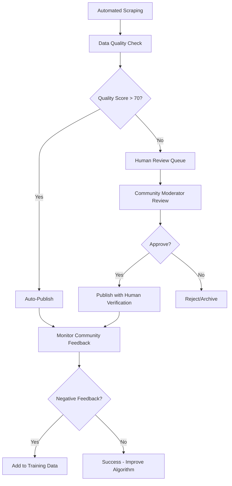

# Funding Sources — Architecture & Implementation

## Overview

The Funding Sources feature enables CivicMatch users to discover, share, and collaborate on funding opportunities (grants, programs, competitions) relevant to social impact projects. This feature transforms funding discovery from an isolated activity into a collaborative community effort, allowing users to find both opportunities and potential collaborators simultaneously.

## Product Vision

### Core Value Proposition
**"Find funding opportunities AND the people to pursue them with"**

- **Discovery**: Browse funding opportunities with advanced filtering (country, deadline, amount)
- **Community Intelligence**: See which CivicMatch users are interested in each opportunity
- **Collaboration**: Connect with others pursuing the same funding for potential partnerships
- **Knowledge Sharing**: Community-driven database of funding opportunities
- **Relationship Building**: Transform funding pursuit from solo to collaborative activity

### User Journey Flow
```
Browse Funding → Filter by Country/Deadline → View Opportunity Details → 
See Interested Users → Express Interest → Connect with Collaborators → 
Apply Together → Add New Opportunities
```

## Technical Architecture

### Route Structure
```
/funding                           # Main funding browse page
/funding/new                      # Add new funding opportunity (modal/page)
/funding/[id]                     # Individual funding details (future)
/api/funding                      # CRUD operations
/api/funding/[id]/interest        # Express/remove interest
```

### Component Architecture
```
FundingPage (Client Component)
├── FundingHeader (Search + Add New Button)
├── FundingFilters (Country, Deadline, Amount filters)
├── FundingGrid (Masonry layout of funding cards)
│   └── FundingCard[] (Individual opportunity cards)
├── FundingDetailsSidebar (Right panel for selected opportunity)
│   ├── FundingDetails (Core info + bookmark)
│   ├── InterestedUsers (Community members)
│   └── FundingActions (Visit site, express interest)
└── AddFundingModal (Create new opportunity)
```

### Add Funding Opportunity Creator

#### Creator Modal/Form Design

**Trigger**: "Add New Funding" button in FundingHeader
**Layout**: Modal overlay (desktop) / Full-screen page (mobile)
**Form Strategy**: Progressive disclosure with required core fields + optional enhancements

#### Desktop Modal Layout
```
┌─────────────────────────────────────────────────────────────┐
│ [×] Add New Funding Opportunity                             │
├─────────────────────────────────────────────────────────────┤
│                                                             │
│ ┌─ Required Information ────────────────────────────────┐   │
│ │                                                       │   │
│ │ 🏷️ Title *                                           │   │
│ │ [Climate Innovation Grant 2024________________]       │   │
│ │                                                       │   │
│ │ 🌍 Country *                 🔗 Website URL *        │   │
│ │ [🇺🇸 United States ▼]      [https://grants.gov/...] │   │
│ │                                                       │   │
│ │ 💰 Amount *                  📅 Deadline *           │   │
│ │ [$ 2,000,000_____] [USD ▼]  [📅 March 15, 2024___] │   │
│ │                                                       │   │
│ └───────────────────────────────────────────────────────┘   │
│                                                             │
│ ┌─ Optional Details ────────────────────────────────────┐   │
│ │                                                       │   │
│ │ 📝 Description (Recommended)                         │   │
│ │ ┌─────────────────────────────────────────────────┐ │   │
│ │ │ Supporting breakthrough climate technologies... │ │   │
│ │ │                                                 │ │   │
│ │ │ (Helps others understand the opportunity)       │ │   │
│ │ └─────────────────────────────────────────────────┘ │   │
│ │                                                       │   │
│ │ ✅ Eligibility Requirements                          │   │
│ │ [US-based startups and research institutions_______] │   │
│ │                                                       │   │
│ └───────────────────────────────────────────────────────┘   │
│                                                             │
│ ┌─────────────────────────────────────────────────────────┐ │
│ │                                                         │ │
│ │ ⚠️ Community Guidelines                                │ │
│ │ • Verify information accuracy before submitting        │ │
│ │ • Write original descriptions (don't copy/paste)       │ │
│ │ • Include relevant details to help others understand   │ │
│ │                                                         │ │
│ │        [Cancel]              [Add Opportunity]         │ │
│ │                                                         │ │
│ └─────────────────────────────────────────────────────────┘ │
└─────────────────────────────────────────────────────────────┘
```

#### Mobile Full-Screen Layout
```
┌─────────────────────────────────┐
│ [←] Add Funding Opportunity     │
├─────────────────────────────────┤
│                                 │
│ Required Information            │
│                                 │
│ 🏷️ Title *                     │
│ ┌─────────────────────────────┐ │
│ │ Climate Innovation Grant... │ │
│ └─────────────────────────────┘ │
│                                 │
│ 🌍 Country *                   │
│ ┌─────────────────────────────┐ │
│ │ 🇺🇸 United States        ▼ │ │
│ └─────────────────────────────┘ │
│                                 │
│ 🔗 Website URL *               │
│ ┌─────────────────────────────┐ │
│ │ https://grants.gov/...      │ │
│ └─────────────────────────────┘ │
│                                 │
│ 💰 Amount * 📅 Deadline *      │
│ ┌─────────┐ ┌─────────────────┐ │
│ │$2M [USD]│ │📅 Mar 15, 2024 │ │
│ └─────────┘ └─────────────────┘ │
│                                 │
│ [Show Optional Details]         │
│                                 │
│ ── Guidelines ──                │
│ • Verify accuracy               │
│ • Original content only         │
│ • Include helpful details       │
│                                 │
├─────────────────────────────────┤
│ [Add Opportunity]               │
└─────────────────────────────────┘
```

#### Form Field Specifications

**Required Fields (Minimal Friction):**
```typescript
interface RequiredFundingFields {
  title: string; // 10-200 characters
  country_code: string; // ISO 2-letter code from dropdown
  deadline: string; // Date picker, required for all opportunities
  website_url: string; // Valid URL with https://
  amount: number; // In cents, with currency selector
  currency: string; // USD, EUR, GBP, etc. (defaults to USD)
}
```

**Optional Fields (Progressive Enhancement):**
```typescript
interface OptionalFundingFields {
  description?: string; // 50-2000 characters, helps others understand
  eligibility?: string; // Requirements description
}
```

#### Form Validation & UX

**Real-time Validation:**
```tsx
const FundingCreatorForm = () => {
  const [formData, setFormData] = useState<CreateFundingRequest>();
  const [errors, setErrors] = useState<Record<string, string>>({});
  
  // Real-time validation
  const validateField = (field: string, value: any) => {
    switch (field) {
      case 'title':
        if (!value || value.length < 10) {
          return 'Title must be at least 10 characters';
        }
        if (value.length > 200) {
          return 'Title must be under 200 characters';
        }
        break;
        
      case 'website_url':
        if (!value || !isValidUrl(value)) {
          return 'Please enter a valid website URL';
        }
        if (!value.startsWith('https://')) {
          return 'URL must start with https:// for security';
        }
        break;
        
      case 'deadline':
        if (!value) {
          return 'Deadline is required';
        }
        const deadlineDate = new Date(value);
        if (deadlineDate <= new Date()) {
          return 'Deadline must be in the future';
        }
        break;
        
      case 'amount':
        if (!value || value < 100) {
          return 'Amount is required and must be at least $1';
        }
        if (value > 100000000000) { // $1B in cents
          return 'Amount must be under $1 billion';
        }
        break;
        
      case 'description':
        if (value && value.length < 50) {
          return 'Description should be at least 50 characters if provided';
        }
        if (value && value.length < 100) {
          return 'Consider adding more details to help others understand';
        }
        break;
    }
    return null;
  };
```

**Smart Form Features:**
```typescript
// Auto-suggest from URL
const handleUrlChange = async (url: string) => {
  if (isValidUrl(url)) {
    // Try to extract title and description from meta tags
    const metadata = await fetchUrlMetadata(url);
    if (metadata.title && !formData.title) {
      setFormData(prev => ({ ...prev, title: metadata.title }));
    }
    if (metadata.description && !formData.description) {
      setFormData(prev => ({ ...prev, description: metadata.description }));
    }
  }
};

// Country flag display
const CountrySelector = ({ value, onChange }) => (
  <Select value={value} onValueChange={onChange}>
    {COUNTRIES.map(country => (
      <SelectItem key={country.code} value={country.code}>
        <div className="flex items-center gap-2">
          <span className="text-lg">{country.flag}</span>
          <span>{country.name}</span>
        </div>
      </SelectItem>
    ))}
  </Select>
);

// Amount formatting with currency (REQUIRED field)
const AmountInput = ({ amount, currency, onChange, error }) => {
  const [displayAmount, setDisplayAmount] = useState('');
  
  const handleAmountChange = (value: string) => {
    // Parse amount and convert to cents
    const numericValue = parseFloat(value.replace(/[^0-9.]/g, ''));
    if (!isNaN(numericValue)) {
      onChange({
        amount: Math.round(numericValue * 100), // Convert to cents
        currency: currency || 'USD'
      });
      setDisplayAmount(formatCurrency(numericValue, currency));
    }
  };
  
  return (
    <div className="space-y-1">
      <div className="flex gap-2">
        <Input
          value={displayAmount}
          onChange={(e) => handleAmountChange(e.target.value)}
          placeholder="2,000,000"
          className="flex-1"
          required
        />
        <Select value={currency} onValueChange={(c) => onChange({ amount, currency: c })}>
          <SelectItem value="USD">USD</SelectItem>
          <SelectItem value="EUR">EUR</SelectItem>
          <SelectItem value="GBP">GBP</SelectItem>
          <SelectItem value="CAD">CAD</SelectItem>
        </Select>
      </div>
      {error && (
        <p className="text-xs text-red-500">{error}</p>
      )}
    </div>
  );
};

// Deadline picker (REQUIRED field)
const DeadlinePicker = ({ value, onChange, error }) => (
  <div className="space-y-1">
    <Input
      type="date"
      value={value}
      onChange={(e) => onChange(e.target.value)}
      min={new Date().toISOString().split('T')[0]} // Today or later
      required
      className="w-full"
    />
    {error && (
      <p className="text-xs text-red-500">{error}</p>
    )}
  </div>
);
```

#### Advanced Creator Features (Future)

**URL-based Auto-fill:**
```typescript
// When user pastes a funding URL, auto-extract information
const handleUrlPaste = async (url: string) => {
  setLoading(true);
  try {
    // Use Firecrawl or similar service to extract structured data
    const extractedData = await extractFundingData(url);
    
    setFormData(prev => ({
      ...prev,
      title: extractedData.title || prev.title,
      description: extractedData.description || prev.description,
      amount: extractedData.amount || prev.amount,
      deadline: extractedData.deadline || prev.deadline,
    }));
    
    toast.success('Information extracted from URL!');
  } catch (error) {
    toast.error('Could not extract information from URL');
  } finally {
    setLoading(false);
  }
};
```

**Duplicate Detection:**
```typescript
// Check for similar opportunities before submission
const checkForDuplicates = async (formData: CreateFundingRequest) => {
  const similar = await supabase
    .from('funding_opportunities')
    .select('id, data')
    .textSearch('data', formData.title, { type: 'websearch' })
    .limit(3);
    
  if (similar.data && similar.data.length > 0) {
    setSimilarOpportunities(similar.data);
    setShowDuplicateWarning(true);
  }
};
```

#### Submission Flow

**Form Submission Process:**
```typescript
const handleSubmit = async (formData: CreateFundingRequest) => {
  // 1. Validate all fields
  const validationErrors = validateAllFields(formData);
  if (validationErrors.length > 0) {
    setErrors(validationErrors);
    return;
  }
  
  // 2. Check for duplicates
  await checkForDuplicates(formData);
  if (showDuplicateWarning) {
    // Show confirmation dialog
    return;
  }
  
  // 3. Submit to database
  setSubmitting(true);
  try {
    const { data, error } = await supabase
      .from('funding_opportunities')
      .insert({
        created_by: user.id,
        data: {
          title: formData.title,
          country_code: formData.country_code,
          website_url: formData.website_url,
          amount: formData.amount,
          currency: formData.currency || 'USD',
          deadline: formData.deadline,
          description: formData.description, // Optional
          eligibility: formData.eligibility, // Optional
          // Metadata
          created_via: 'manual',
          creator_ip: await getClientIP(), // For spam prevention
        }
      })
      .select()
      .single();
      
    if (error) throw error;
    
    // 4. Success feedback
    toast.success('Funding opportunity added successfully!');
    
    // 5. Navigate to new opportunity or close modal
    if (data) {
      router.push(`/funding?highlight=${data.id}`);
    }
    
  } catch (error) {
    toast.error('Failed to add opportunity. Please try again.');
  } finally {
    setSubmitting(false);
  }
};
```

#### Community Guidelines Integration

**Guidelines Display:**
```tsx
const CommunityGuidelines = () => (
  <div className="bg-[color:var(--muted)]/20 rounded-lg p-4 space-y-2">
    <div className="flex items-center gap-2 text-sm font-medium">
      <AlertCircle className="size-4 text-[color:var(--accent)]" />
      <span>Community Guidelines</span>
    </div>
    <ul className="text-xs text-[color:var(--muted-foreground)] space-y-1 ml-6">
      <li>• Verify all information for accuracy before submitting</li>
      <li>• Write original descriptions - don't copy/paste from source</li>
      <li>• Include relevant details to help others understand the opportunity</li>
      <li>• Only add legitimate funding opportunities you've verified</li>
      <li>• Respect intellectual property and attribution requirements</li>
    </ul>
  </div>
);
```

**Anti-Spam Measures:**
```typescript
// Rate limiting per user
const checkRateLimit = async (userId: string) => {
  const recentSubmissions = await supabase
    .from('funding_opportunities')
    .select('created_at')
    .eq('created_by', userId)
    .gte('created_at', new Date(Date.now() - 24 * 60 * 60 * 1000).toISOString())
    .limit(5);
    
  if (recentSubmissions.data && recentSubmissions.data.length >= 5) {
    throw new Error('Rate limit exceeded. Maximum 5 opportunities per day.');
  }
};
```

### Database Schema

#### New Table: `funding_opportunities` (JSONB-first approach)
```sql
-- Funding opportunities following CivicMatch JSONB-first pattern
create table if not exists public.funding_opportunities (
  id         uuid primary key default gen_random_uuid(),
  created_by uuid not null references auth.users(id) on delete cascade,
  created_at timestamptz not null default now(),
  updated_at timestamptz not null default now(),
  data       jsonb not null default '{}'
);

-- Essential indexes for performance
create index if not exists funding_opportunities_created_by_idx on public.funding_opportunities(created_by);
create index if not exists funding_opportunities_data_gin on public.funding_opportunities using gin (data jsonb_path_ops);
create index if not exists funding_opportunities_created_at_idx on public.funding_opportunities(created_at desc);

-- Specialized indexes for common filter operations (expression indexes on JSONB)
create index if not exists funding_opportunities_country_idx on public.funding_opportunities using btree ((data->>'country_code'));
create index if not exists funding_opportunities_deadline_idx on public.funding_opportunities using btree (((data->>'deadline')::timestamptz));
create index if not exists funding_opportunities_amount_idx on public.funding_opportunities using btree (((data->>'amount')::bigint));

-- Set updated_at trigger
create trigger funding_opportunities_set_updated_at
before update on public.funding_opportunities
for each row execute function set_updated_at();
```

#### New Table: `funding_interests` (JSONB-first approach)
```sql
create table if not exists public.funding_interests (
  id                    uuid primary key default gen_random_uuid(),
  funding_opportunity_id uuid not null references public.funding_opportunities(id) on delete cascade,
  user_id               uuid not null references auth.users(id) on delete cascade,
  created_at            timestamptz not null default now(),
  updated_at            timestamptz not null default now(),
  data                  jsonb not null default '{}', -- Notes, collaboration preferences, etc.
  
  -- Prevent duplicate interests
  constraint funding_interests_unique unique (funding_opportunity_id, user_id)
);

-- Indexes for performance
create index if not exists funding_interests_funding_idx on public.funding_interests(funding_opportunity_id);
create index if not exists funding_interests_user_idx on public.funding_interests(user_id);
create index if not exists funding_interests_data_gin on public.funding_interests using gin (data jsonb_path_ops);

-- Set updated_at trigger
create trigger funding_interests_set_updated_at
before update on public.funding_interests
for each row execute function set_updated_at();
```

#### RLS Security Policies
```sql
-- Funding Opportunities
alter table public.funding_opportunities enable row level security;

-- Anyone can read funding opportunities
create policy "funding_opportunities_select_all" on public.funding_opportunities
for select using (true);

-- Authenticated users can create opportunities
create policy "funding_opportunities_insert_authenticated" on public.funding_opportunities
for insert to authenticated with check (auth.uid() = created_by);

-- Creators can update their own opportunities
create policy "funding_opportunities_update_own" on public.funding_opportunities
for update to authenticated using (auth.uid() = created_by);

-- Creators can delete their own opportunities
create policy "funding_opportunities_delete_own" on public.funding_opportunities
for delete to authenticated using (auth.uid() = created_by);

-- Funding Interests
alter table public.funding_interests enable row level security;

-- Users can see interests for opportunities they can see
create policy "funding_interests_select_all" on public.funding_interests
for select using (true);

-- Authenticated users can express interest
create policy "funding_interests_insert_own" on public.funding_interests
for insert to authenticated with check (auth.uid() = user_id);

-- Users can update/delete their own interests
create policy "funding_interests_update_own" on public.funding_interests
for update to authenticated using (auth.uid() = user_id);

create policy "funding_interests_delete_own" on public.funding_interests
for delete to authenticated using (auth.uid() = user_id);
```

### Data Models

#### TypeScript Interfaces (JSONB-first approach)
```typescript
interface FundingOpportunity {
  id: string;
  created_by: string;
  created_at: string;
  updated_at: string;
  data: {
    // Core funding information (stored in JSONB)
    title: string;
    country_code: string; // ISO 2-letter codes (US, UK, DE, etc.)
    amount: number; // Amount in cents (REQUIRED)
    currency: string; // USD, EUR, GBP, etc. (REQUIRED, defaults to USD)
    deadline: string; // ISO date string (REQUIRED)
    website_url: string; // External funding website
    description?: string; // About section (OPTIONAL)
    
    // Additional metadata (flexible JSONB fields)
    eligibility?: string; // Eligibility requirements
    
    // Scraping metadata (for future automated updates)
    source_url?: string; // Original source where this was found
    last_scraped?: string; // ISO date of last scrape update
    scrape_source?: "manual" | "firecrawl" | "api";
    scrape_confidence?: number; // 0-1 confidence in scraped data accuracy
  };
  
  // Computed fields (from joins/aggregations)
  creator?: {
    username: string;
    displayName?: string;
    avatarUrl?: string;
  };
  interested_users?: InterestedUser[];
  interest_count?: number;
  user_is_interested?: boolean; // For current user
}

interface FundingInterest {
  id: string;
  funding_opportunity_id: string;
  user_id: string;
  created_at: string;
  updated_at: string;
  data: {
    // MVP: Empty object for simple interest expression
    // All fields below are optional and collected progressively
    
    // Phase 2: Optional collaboration details
    collaboration_interest?: "lead" | "partner" | "support";
    notes?: string;
    skills_offered?: string[]; // Selected from user's existing profile skills
    availability?: string; // Time commitment available
    contact_preference?: "direct" | "through_platform";
    
    // Phase 3: Advanced fields (future)
    experience_level?: "beginner" | "intermediate" | "expert";
    previous_applications?: boolean; // Has applied to similar funding before
    application_deadline_reminder?: boolean; // Wants deadline reminders
    
    // System-generated fields (not user input)
    enhanced_at?: string; // When user added details (vs. simple interest)
    profile_match_score?: number; // AI-calculated relevance (0-100)
  };
}

interface InterestedUser {
  user_id: string;
  username: string;
  displayName?: string;
  avatarUrl?: string;
  bio?: string;
  skills?: string[];
  interest_created_at: string;
  collaboration_interest?: string;
}
```

## UI/UX Design Architecture

### Layout System

#### Desktop Layout (≥1024px) ✅ IMPLEMENTED
```
┌─────────────────────────────────────────────────────────────────────┐
│ TopBar (Global) + New "Funding" Tab (Euro Icon)                    │
├─────────────────────────────────────────────────────────────────────┤
│ Funding Opportunities (FIXED HEADER)                               │
│ [🔍 Search] [Countries ▼] [Deadlines ▼] [Amounts ▼] [Sort ▼] [+ Add] │
├─────────────────────────────────────────────────────────────────────┤
│ ┌─────────────┐ ┌─────────────────────┐ ┌─────────────────────────┐ │
│ │ Calendar    │ │ Funding List        │ │ Funding Details         │ │
│ │             │ │ (SCROLLABLE)        │ │ (Content-Fit Height)    │ │
│ │ 2025        │ │                     │ │ ┌─────────────────────┐ │ │
│ │  Dec (2)    │ │ ┌─ Selected Card ─┐ │ │ │[Express] [Bookmark] │ │ │
│ │  Mar (4)    │ │ │🇺🇸         👤👤│ │ │ │[Website →]         │ │ │
│ │             │ │ │Climate Grant    │ │ │ └─────────────────────┘ │ │
│ │ 2024        │ │ │$2M • Jan 15     │ │ │                         │ │
│ │  Jun (1)    │ │ │🟠 Orange Outline│ │ │ 🇺🇸 Climate Grant      │ │
│ │             │ │ └─────────────────┘ │ │                         │ │
│ │ Total: 8    │ │                     │ │ ┌─────────┐ ┌─────────┐ │ │
│ │             │ │ Other Cards...      │ │ │$2M      │ │Jan 15   │ │ │
│ │             │ │ (Vertical Stack)    │ │ │Amount   │ │Deadline │ │ │
│ │             │ │ ↕ Scroll continues  │ │ └─────────┘ └─────────┘ │ │
│ │             │ │                     │ │                         │ │
│ │             │ │ Time Groups:        │ │ ┌─────────┐ ┌─────────┐ │ │
│ │             │ │ - This week         │ │ │About    │ │Eligib.  │ │ │
│ │             │ │ - This month        │ │ │Content  │ │Content  │ │ │
│ │             │ │ - January 2025      │ │ └─────────┘ └─────────┘ │ │
│ │             │ │ - March 2025        │ │                         │ │
│ └─────────────┘ └─────────────────────┘ │ Added by: [👤] User     │ │
│                                         │                         │ │
│                                         │ 👥 Community Interest   │ │
│                                         │ Connect with others...  │ │
│                                         │ [User avatars]          │ │
│                                         └─────────────────────────┘ │
└─────────────────────────────────────────────────────────────────────┘
```

#### Mobile Layout (<768px)
```
┌─────────────────────────────────┐
│ TopBar (Global) + Funding Tab   │
├─────────────────────────────────┤
│ [🔍] Search + [+] Add New       │
├─────────────────────────────────┤
│ Filters (Horizontal Scroll)     │
│ [🌍Country▼][📅Deadline▼][💰▼]  │
├─────────────────────────────────┤
│                                 │
│ Funding Cards (Vertical Stack)  │
│ ┌─────────────────────────────┐ │
│ │ 🇺🇸 Climate Innovation Fund │ │
│ │ $2M • Deadline: Jan 15      │ │
│ │ 👤👤👤 +5 interested         │ │
│ └─────────────────────────────┘ │
│ ┌─────────────────────────────┐ │
│ │ 🇪🇺 European Green Grant    │ │
│ │ €500K • Deadline: Feb 28    │ │
│ │ 👤👤 +8 interested           │ │
│ └─────────────────────────────┘ │
│                                 │
│ [Load More Opportunities]       │
└─────────────────────────────────┘

// Details open as full-screen modal
┌─────────────────────────────────┐
│ [← Back] Funding Details        │
├─────────────────────────────────┤
│ 🇺🇸 Climate Innovation Fund     │
│ $2,000,000 • Deadline: Jan 15  │
│                                 │
│ 📝 About this opportunity...    │
│                                 │
│ 👥 12 CivicMatch users interested│
│ [👤] [👤] [👤] [👤] [Show All]   │
│                                 │
│ Added by: [👤] John Smith       │
│                                 │
│ [🔖 Bookmark] [🌐 Visit Site]   │
│ [💬 Express Interest]           │
└─────────────────────────────────┘
```

### Visual Design System

#### FundingCard Component ✅ IMPLEMENTED
```tsx
// Redesigned funding card with flag top-left, avatars top-right
<div className={`card group cursor-pointer hover:shadow-lg transition-all duration-200 relative ${
  isSelected 
    ? 'ring-2 ring-[color:var(--accent)] border-[color:var(--accent)] shadow-lg shadow-[color:var(--accent)]/20' 
    : 'hover:border-[color:var(--accent)]/30'
}`}>
  {/* Country Flag - Top Left Corner */}
  <div className="absolute top-4 left-4 text-2xl z-10">
    {getCountryFlag(funding.data.country_code)}
  </div>
  
  {/* Interested Users Avatars - Top Right, Stacked */}
  {funding.interest_count > 0 && (
    <div className="absolute top-4 right-4 flex">
      {Array.from({ length: Math.min(4, funding.interest_count) }).map((_, i) => (
        <div 
          key={i} 
          className="size-6 rounded-full bg-[color:var(--accent)]/20 border border-[color:var(--background)] flex items-center justify-center text-xs font-medium text-[color:var(--accent)] shadow-sm"
          style={{ 
            marginLeft: i > 0 ? '-8px' : '0',
            zIndex: 10 - i 
          }}
        >
          {String.fromCharCode(65 + i)}
        </div>
      ))}
      {funding.interest_count > 4 && (
        <div className="size-6 rounded-full bg-[color:var(--muted)]/60 border border-[color:var(--background)] flex items-center justify-center text-xs font-medium shadow-sm">
          +{funding.interest_count - 4}
        </div>
      )}
    </div>
  )}
  
  <div className="pt-12 space-y-3">
    {/* Title */}
    <h3 className="font-semibold text-lg leading-tight line-clamp-2 group-hover:text-[color:var(--accent)]">
      {funding.data.title}
    </h3>
    
    {/* Amount and Deadline - No Icons */}
    <div className="flex items-center gap-4 text-sm text-[color:var(--muted-foreground)]">
      <div className="flex items-center gap-1">
        <DollarSign className="size-4" />
        <span className="font-medium">{formatAmount(funding.data.amount, funding.data.currency)}</span>
      </div>
      
      <div className="flex items-center gap-1">
        <Calendar className="size-4" />
        <span className={`font-medium ${getDeadlineUrgency(funding.data.deadline)}`}>
          {formatDeadline(funding.data.deadline)}
        </span>
      </div>
    </div>
  </div>
</div>
```

**Key Features:**
- **Orange selection outline**: Ring + border + shadow for selected cards
- **Stacked avatars**: Top-right corner with overlapping effect
- **Clean design**: No description preview, no embedded action buttons
- **Full-card clickable**: Entire card area selects the funding opportunity
- **Time-based grouping**: Cards organized by "This week", "This month", "Month Year"

#### Country Flag System ✅ IMPLEMENTED
```typescript
// Comprehensive country flags (60+ countries)
const COUNTRY_FLAGS = {
  'US': '🇺🇸', 'UK': '🇬🇧', 'DE': '🇩🇪', 'FR': '🇫🇷', 
  'EU': '🇪🇺', 'CA': '🇨🇦', 'AU': '🇦🇺', 'JP': '🇯🇵',
  'BR': '🇧🇷', 'IN': '🇮🇳', 'CN': '🇨🇳', 'MX': '🇲🇽',
  'ES': '🇪🇸', 'IT': '🇮🇹', 'NL': '🇳🇱', 'SE': '🇸🇪',
  'NO': '🇳🇴', 'DK': '🇩🇰', 'FI': '🇫🇮', 'CH': '🇨🇭',
  // ... 60+ countries with full regional coverage
} as const;

// Comprehensive country options for filters (60+ countries)
const COUNTRIES = [
  // Major funding countries prioritized
  { code: 'US', name: 'United States', flag: '🇺🇸' },
  { code: 'EU', name: 'European Union', flag: '🇪🇺' },
  { code: 'UK', name: 'United Kingdom', flag: '🇬🇧' },
  // ... includes Europe, Asia-Pacific, Americas, Africa, Middle East
];

const getCountryFlag = (countryCode: string): string => {
  return COUNTRY_FLAGS[countryCode as keyof typeof COUNTRY_FLAGS] || '🌍';
};
```

**Coverage:**
- **Major funding regions**: US, EU, UK, Canada, Australia prioritized
- **European countries**: All EU member states plus Norway, Switzerland, UK
- **Asia-Pacific**: Japan, South Korea, Singapore, Australia, New Zealand
- **Americas**: North, Central, and South America representation
- **Emerging markets**: India, China, Brazil, South Africa, Nigeria

#### Calendar Sidebar Component ✅ IMPLEMENTED
```tsx
// Time-based navigation sidebar (208px width)
function CalendarSidebar({ opportunities, onMonthSelect }) {
  const calendarData = groupOpportunitiesByCalendar(opportunities);
  
  return (
    <div className="w-52 card space-y-4 h-fit">
      <div className="space-y-4 max-h-96 overflow-y-auto">
        {Object.entries(calendarData).map(([year, months]) => (
          <div key={year} className="space-y-2">
            <h4 className="font-semibold text-base text-[color:var(--accent)]">{year}</h4>
            <div className="space-y-1 ml-2">
              {Object.entries(months).map(([month, count]) => (
                <button
                  key={`${year}-${month}`}
                  onClick={() => onMonthSelect(year, month)}
                  className="w-full flex items-center justify-between p-2 rounded-lg hover:bg-[color:var(--muted)]/20 transition-colors text-left"
                >
                  <span className="text-sm">{month}</span>
                  <span className="text-xs text-[color:var(--muted-foreground)] bg-[color:var(--muted)]/30 px-2 py-1 rounded-full">
                    {count}
                  </span>
                </button>
              ))}
            </div>
          </div>
        ))}
      </div>
      
      <div className="text-xs text-[color:var(--muted-foreground)] pt-2 border-t border-[color:var(--border)]">
        Total: {opportunities.length}
      </div>
    </div>
  );
}
```

**Features:**
- **Chronological organization**: Years descending (2025 → 2024), newest months first
- **Opportunity counts**: Simple numbers without "opportunities" text
- **Interactive navigation**: Click month/year to filter opportunities
- **Compact design**: 208px width (20% smaller than original)
- **Clean styling**: No header text, just pure calendar navigation

### Filter System Architecture ✅ IMPLEMENTED

#### Inline Filter Implementation ✅ IMPLEMENTED
```tsx
// Inline filters positioned below title, alongside search and Add button
<div className="flex flex-col lg:flex-row gap-4 lg:items-center">
  {/* Search Bar - Takes flex-1 space */}
  <div className="relative flex-1">
    <Search className="absolute left-3 top-1/2 transform -translate-y-1/2 size-4 text-[color:var(--muted-foreground)]" />
    <input
      type="text"
      placeholder="Search funding opportunities..."
      value={filters.search}
      onChange={(e) => setFilters(prev => ({ ...prev, search: e.target.value }))}
      className="w-full h-10 pl-10 pr-4 rounded-full border border-[color:var(--border)] bg-[color:var(--background)]"
    />
  </div>

  {/* Filter Dropdowns */}
  <div className="flex items-center gap-3 overflow-x-auto">
    <select value={filters.countries[0] || ''} className="h-10 px-3 rounded-full border">
      <option value="">All Countries</option>
      {COUNTRIES.map(country => (
        <option key={country.code} value={country.code}>
          {country.flag} {country.name}
        </option>
      ))}
    </select>
    
    <select value={filters.deadlineRange} className="h-10 px-3 rounded-full border">
      <option value="all">All Deadlines</option>
      <option value="next-30-days">Next 30 days</option>
      <option value="next-3-months">Next 3 months</option>
      <option value="next-6-months">Next 6 months</option>
    </select>
    
    <select value={filters.amountRange} className="h-10 px-3 rounded-full border">
      <option value="all">All Amounts</option>
      <option value="under-50k">Under $50K</option>
      <option value="50k-500k">$50K - $500K</option>
      <option value="500k-plus">$500K+</option>
    </select>
    
    <select value={filters.sortBy} className="h-10 px-3 rounded-full border">
      <option value="deadline-asc">Deadline (Soonest)</option>
      <option value="deadline-desc">Deadline (Latest)</option>
      <option value="amount-desc">Amount (Highest)</option>
      <option value="interest-desc">Most Interest</option>
      <option value="created-desc">Recently Added</option>
    </select>
  </div>
  
  {/* Add New Funding Button */}
  <button className="h-10 px-4 inline-flex items-center gap-2 rounded-full bg-[color:var(--accent)] text-[color:var(--background)]">
    <Plus className="size-4" />
    Add New Funding
  </button>
</div>
```

**Key Features:**
- **Single row layout**: Search, filters, and add button all inline
- **Responsive design**: Stacks vertically on mobile, horizontal on desktop
- **Real-time filtering**: Immediate results update on filter changes
- **Space efficient**: Maximizes content area for funding opportunities

#### Funding Details Sidebar ✅ IMPLEMENTED
```tsx
// Enhanced details sidebar with optimized layout
function FundingDetailsSidebar({ funding, onExpressInterest }) {
  return (
    <div className="h-fit card space-y-6">
      {/* Action Bar - Top */}
      <div className="flex items-center justify-between">
        {/* Express Interest - Top Left */}
        <button className={`h-10 px-4 inline-flex items-center gap-2 rounded-full ${
          funding.user_is_interested
            ? 'bg-[color:var(--accent)]/10 text-[color:var(--accent)] border border-[color:var(--accent)]/20'
            : 'bg-[color:var(--accent)] text-[color:var(--background)]'
        }`}>
          <Heart className="size-4" />
          {funding.user_is_interested ? 'Interested' : 'Express Interest'}
        </button>
        
        {/* Bookmark and Website - Top Right */}
        <div className="flex items-center gap-3">
          <button className="h-10 px-3 inline-flex items-center gap-2 rounded-full border">
            <Bookmark className="size-4" />
            <span>Bookmark</span>
          </button>
          
          <a href={funding.data.website_url} target="_blank" className="h-10 px-3 inline-flex items-center gap-2 rounded-full border">
            <span>Website</span>
            <ArrowRight className="size-4" />
          </a>
        </div>
      </div>
      
      {/* Title and Flag */}
      <div className="flex items-start gap-4">
        <div className="text-4xl">{getCountryFlag(funding.data.country_code)}</div>
        <h3 className="font-bold text-2xl leading-tight">{funding.data.title}</h3>
      </div>
      
      {/* Amount and Deadline - Side by Side, No Icons */}
      <div className="grid grid-cols-2 gap-4">
        <div className="p-4 bg-[color:var(--muted)]/10 rounded-xl">
          <div className="text-sm text-[color:var(--muted-foreground)]">Funding Amount</div>
          <div className="font-bold text-xl text-[color:var(--accent)]">
            {formatAmount(funding.data.amount, funding.data.currency)}
          </div>
        </div>
        
        <div className="p-4 bg-[color:var(--muted)]/10 rounded-xl">
          <div className="text-sm text-[color:var(--muted-foreground)]">Application Deadline</div>
          <div className="font-bold text-lg">{formatDeadline(funding.data.deadline)}</div>
          <div className="text-xs text-[color:var(--muted-foreground)]">
            {new Date(funding.data.deadline).toLocaleDateString('en-US', { 
              weekday: 'long', year: 'numeric', month: 'long', day: 'numeric' 
            })}
          </div>
        </div>
      </div>
      
      {/* About and Eligibility - Side by Side with Backgrounds */}
      <div className="grid grid-cols-1 md:grid-cols-2 gap-4">
        {funding.data.description && (
          <div className="p-4 bg-[color:var(--muted)]/10 rounded-xl space-y-2">
            <h4 className="font-semibold text-lg">About</h4>
            <p className="text-[color:var(--muted-foreground)] leading-relaxed text-sm">
              {funding.data.description}
            </p>
          </div>
        )}
        
        {funding.data.eligibility && (
          <div className="p-4 bg-[color:var(--muted)]/10 rounded-xl space-y-2">
            <h4 className="font-semibold text-lg">Eligibility</h4>
            <p className="text-[color:var(--muted-foreground)] leading-relaxed text-sm">
              {funding.data.eligibility}
            </p>
          </div>
        )}
      </div>
      
      {/* Creator Info */}
      <div className="space-y-3">
        <h4 className="font-semibold text-lg">Added by</h4>
        <div className="flex items-center gap-3 p-3 bg-[color:var(--muted)]/10 rounded-xl">
          <div className="size-12 rounded-full overflow-hidden bg-[color:var(--muted)]/40 border">
            {/* Avatar or initials */}
          </div>
          <div>
            <div className="font-medium">{funding.creator.displayName}</div>
            <div className="text-xs text-[color:var(--muted-foreground)]">
              Added {new Date(funding.created_at).toLocaleDateString()}
            </div>
          </div>
        </div>
      </div>
      
      {/* Community Interest */}
      <div className="space-y-3">
        <div className="flex items-center justify-between">
          <h4 className="font-semibold text-lg flex items-center gap-2">
            <Users className="size-5 text-[color:var(--accent)]" />
            Community Interest
          </h4>
          <span className="text-sm text-[color:var(--muted-foreground)]">
            Connect with others pursuing this opportunity
          </span>
        </div>
        
        <div className="p-4 bg-[color:var(--muted)]/10 rounded-xl">
          {/* User avatars display or empty state */}
        </div>
      </div>
    </div>
  );
}
```

**Implementation Features:**
- **Content-fit height**: `h-fit` instead of full height for natural sizing
- **Action bar at top**: Express Interest, Bookmark, and Website buttons prominently placed
- **No redundant icons**: Removed DollarSign and Calendar icons from amount/deadline
- **Consistent backgrounds**: All content sections use matching rounded backgrounds
- **Space optimized**: Side-by-side layouts for related information
- **Community focus**: "Community Interest" title with inline collaboration message

#### Three-Panel Layout Architecture ✅ IMPLEMENTED

**Layout Proportions:**
```typescript
// Optimized three-panel desktop layout
<div className="flex gap-6 h-[calc(100vh-180px)]">
  {/* Calendar Sidebar - Left (208px) */}
  <CalendarSidebar opportunities={opportunities} onMonthSelect={handleMonthFilter} />
  
  {/* Funding List - Center (flex-1, scrollable) */}
  <div className="flex-1 space-y-4 overflow-y-auto pr-3 funding-scroll">
    {/* Time-grouped funding cards */}
  </div>
  
  {/* Details Sidebar - Right (flex-1, content-fit) */}
  <div className="flex-1 overflow-y-auto funding-scroll">
    <FundingDetailsSidebar funding={selectedFunding} onExpressInterest={handleExpressInterest} />
  </div>
</div>
```

**Key Design Decisions:**
- **Fixed header**: Search and filters remain visible during scrolling
- **Independent scrolling**: Only funding list scrolls, calendar and details are positioned
- **Equal content panels**: Funding list and details share available space equally
- **Compact calendar**: 208px width provides navigation without dominating layout
- **Custom scrollbars**: Transparent backgrounds with themed colors for clean appearance

**Scroll Behavior:**
- **Header stays fixed**: Search bar and filters always accessible
- **List scrolls independently**: Smooth scrolling through funding opportunities with time groups
- **Details fit content**: Sidebar only takes needed space, can scroll if content is long
- **Calendar stays visible**: Quick navigation always available

**Time-Based Organization:**
- **Urgent groups first**: "This week" and "This month" appear at top
- **Chronological months**: "January 2025", "March 2025", etc. in date order
- **Visual grouping**: Clear section headers with opportunity counts
- **Calendar navigation**: Click month/year to filter opportunities by time period

## Data Flow & API Design

### Core API Endpoints

#### GET /api/funding
```typescript
interface FundingListRequest {
  search?: string;
  countries?: string[]; // Country codes
  deadline_before?: string; // ISO date
  deadline_after?: string; // ISO date
  amount_min?: number; // In cents
  amount_max?: number; // In cents
  sort_by?: 'deadline_asc' | 'deadline_desc' | 'amount_desc' | 'interest_desc';
  limit?: number; // Default 24
  offset?: number; // For pagination
}

interface FundingListResponse {
  opportunities: FundingOpportunity[];
  total_count: number;
  has_more: boolean;
  next_offset?: number;
}
```

#### POST /api/funding
```typescript
interface CreateFundingRequest {
  title: string;
  country_code: string;
  amount: number; // In cents (REQUIRED)
  currency: string; // Defaults to USD
  deadline: string; // ISO date (REQUIRED)
  website_url: string;
  description?: string; // Optional
  eligibility?: string; // Optional
}
```

#### POST /api/funding/[id]/interest
```typescript
interface ExpressInterestRequest {
  notes?: string;
  collaboration_interest?: 'lead' | 'partner' | 'support';
}

// DELETE same endpoint to remove interest
```

### Database Query Optimization

#### Efficient Funding List Query (JSONB-first)
```sql
-- Main funding opportunities query with interested user counts (JSONB-first approach)
SELECT 
  fo.id,
  fo.created_by,
  fo.created_at,
  fo.updated_at,
  fo.data,
  COUNT(fi.user_id) as interest_count,
  EXISTS(
    SELECT 1 FROM funding_interests fi2 
    WHERE fi2.funding_opportunity_id = fo.id 
    AND fi2.user_id = $current_user_id
  ) as user_is_interested,
  -- Creator info from profiles
  p.username as creator_username,
  p.data->>'displayName' as creator_display_name,
  p.data->>'avatarUrl' as creator_avatar_url
FROM funding_opportunities fo
LEFT JOIN funding_interests fi ON fi.funding_opportunity_id = fo.id
LEFT JOIN profiles p ON p.user_id = fo.created_by
WHERE 
  ($search IS NULL OR 
   fo.data->>'title' ILIKE '%' || $search || '%' OR 
   fo.data->>'description' ILIKE '%' || $search || '%')
  AND ($countries IS NULL OR fo.data->>'country_code' = ANY($countries))
  AND ($deadline_after IS NULL OR (fo.data->>'deadline')::timestamptz >= $deadline_after)
  AND ($deadline_before IS NULL OR (fo.data->>'deadline')::timestamptz <= $deadline_before)
  AND ($amount_min IS NULL OR (fo.data->>'amount')::bigint >= $amount_min)
  AND ($amount_max IS NULL OR (fo.data->>'amount')::bigint <= $amount_max)
GROUP BY fo.id, fo.created_by, fo.created_at, fo.updated_at, fo.data, p.username, p.data
ORDER BY 
  CASE WHEN $sort_by = 'deadline_asc' THEN (fo.data->>'deadline')::timestamptz END ASC NULLS LAST,
  CASE WHEN $sort_by = 'deadline_desc' THEN (fo.data->>'deadline')::timestamptz END DESC NULLS LAST,
  CASE WHEN $sort_by = 'amount_desc' THEN (fo.data->>'amount')::bigint END DESC NULLS LAST,
  CASE WHEN $sort_by = 'interest_desc' THEN COUNT(fi.user_id) END DESC,
  CASE WHEN $sort_by = 'created_desc' THEN fo.created_at END DESC
LIMIT $limit OFFSET $offset;
```

#### Interested Users Query (JSONB-first)
```sql
-- Get interested users for a specific funding opportunity
SELECT 
  fi.id,
  fi.user_id,
  fi.created_at as interest_created_at,
  fi.updated_at,
  fi.data as interest_data,
  p.username,
  p.data->>'displayName' as display_name,
  p.data->>'avatarUrl' as avatar_url,
  p.data->>'bio' as bio,
  p.data->'skills' as skills
FROM funding_interests fi
JOIN profiles p ON p.user_id = fi.user_id
WHERE fi.funding_opportunity_id = $funding_id
ORDER BY fi.created_at DESC
LIMIT 50;
```

#### Example JSONB Data Structures

**Example `funding_opportunities.data` payload:**
```json
{
  "title": "Climate Innovation Grant 2024",
  "country_code": "US",
  "amount": 2000000,
  "currency": "USD", 
  "deadline": "2024-03-15T23:59:59Z",
  "website_url": "https://climatetech.gov/grants/innovation-2024",
  "description": "Supporting breakthrough climate technologies with potential for global impact. Focus areas include renewable energy, carbon capture, and sustainable agriculture innovations.",
  "eligibility": "EU-based startups and research institutions"
}
```

**Example `funding_interests.data` payload:**
```json
{
  "notes": "Interested in collaborating on carbon capture technology applications",
  "collaboration_interest": "partner",
  "contact_preference": "through_platform",
  "skills_offered": ["machine-learning", "climate-modeling", "grant-writing"],
  "availability": "10-15 hours per week",
  "experience_level": "expert",
  "previous_applications": true
}
```

## Integration with Existing Architecture

### TopBar Navigation Enhancement ✅ IMPLEMENTED
```tsx
// Updated TopBar component with Funding tab
import { ArrowLeft, Compass, Euro, Mail, UsersRound } from "lucide-react";

// Navigation implementation
<Link href="/funding" className={pillClasses(isFunding)} aria-label="Funding">
  <Euro className="size-4" />
  <span className="hidden md:inline">Funding</span>
</Link>

// Active state detection
const isFunding = pathname.startsWith("/funding");
```

**Implementation Details:**
- **Euro icon**: Uses `Euro` instead of `DollarSign` for international appeal
- **Consistent styling**: Matches existing pill navigation system
- **Active state**: Orange accent when on funding pages
- **Responsive**: Shows icon only on mobile, icon + text on desktop

### Consistent Design Language
- **Card System**: Use existing `card` class for funding cards
- **Pill Buttons**: Consistent with explore/profiles filter pills
- **Color Scheme**: Accent colors for CTAs, muted for secondary info
- **Typography**: Same font hierarchy and spacing system
- **Icons**: Lucide icons for consistency (DollarSign, Calendar, MapPin, etc.)

### Auth Integration
- **User Context**: Leverage existing `useAuth()` hook
- **Profile Data**: Reuse profile avatar/name display patterns
- **Permissions**: Follow existing RLS patterns for data access

## Bookmark System Architecture ✅ IMPLEMENTED

### Overview

The bookmark system allows users to save funding opportunities for later reference, integrated seamlessly with the existing interest system using the `funding_interests` table with JSONB data storage.

### Database Integration (JSONB-first Approach)

#### Architecture Decision: funding_interests Integration
**Chosen Approach**: Store bookmarks as JSONB data within existing `funding_interests` records

**Why This Architecture:**
- **Semantic Alignment**: Bookmarking is a form of interest in funding opportunities
- **Single Query Efficiency**: Fetch interests and bookmarks in one database operation
- **JSONB Flexibility**: Leverages CivicMatch's JSONB-first pattern for data storage
- **Existing Infrastructure**: Uses established table structure and RLS policies
- **Progressive Enhancement**: Bookmarks coexist with collaboration preferences

#### Enhanced funding_interests.data Structure
```json
{
  // Existing interest fields (optional)
  "collaboration_interest": "partner",
  "notes": "Interested in climate tech collaboration",
  "skills_offered": ["machine-learning", "grant-writing"],
  
  // NEW: Bookmark fields
  "is_bookmarked": true,
  "bookmarked_at": "2024-01-15T10:00:00Z"
}
```

#### Database Operations

**Bookmark-Only (No Interest):**
```sql
INSERT INTO funding_interests (funding_opportunity_id, user_id, data)
VALUES (uuid, uuid, '{"is_bookmarked": true, "bookmarked_at": "2024-01-15T10:00:00Z"}')
```

**Add Bookmark to Existing Interest:**
```sql
UPDATE funding_interests 
SET data = data || '{"is_bookmarked": true, "bookmarked_at": "2024-01-15T10:00:00Z"}'
WHERE funding_opportunity_id = uuid AND user_id = uuid
```

**Remove Bookmark:**
```sql
UPDATE funding_interests 
SET data = data || '{"is_bookmarked": false, "bookmarked_at": null}'
WHERE funding_opportunity_id = uuid AND user_id = uuid
```

### User State Combinations

The system supports four distinct user states per funding opportunity:

1. **Neither Interested nor Bookmarked**: No record in funding_interests
2. **Interested Only**: Record exists with empty data or collaboration preferences
3. **Bookmarked Only**: Record exists with `"is_bookmarked": true`
4. **Both Interested and Bookmarked**: Record with both interest data and bookmark flag

### UI Implementation

#### Visual States
- **Unbookmarked**: Empty bookmark icon with muted styling
- **Bookmarked**: Filled bookmark icon with accent color and background
- **Button Text**: "Bookmark" → "Bookmarked" with visual feedback

#### Responsive Design
- **Desktop Sidebar**: Standard bookmark button in action bar
- **Mobile Modal**: Full-width bookmark button in bottom action sheet
- **Consistent Styling**: Same visual states across all screen sizes

### Performance Optimizations

#### Single Query Strategy
```typescript
// Main funding query includes bookmark data
funding_interests(user_id, data)

// Transform includes bookmark detection
const userHasBookmarked = interests.some(interest => 
  interest.user_id === currentUserId && interest.data?.is_bookmarked === true
)
```

#### Optimistic Updates
```typescript
// Immediate UI feedback before database confirmation
setOpportunities(prev => prev.map(opp => 
  opp.id === fundingId 
    ? { ...opp, user_has_bookmarked: !isBookmarked }
    : opp
));
```

### Filter Integration

#### Bookmarked Filter Implementation
```typescript
// Client-side filtering after database fetch
if (filters.bookmarked) {
  transformedData = transformedData.filter(opportunity => 
    opportunity.user_has_bookmarked
  );
}
```

#### Filter UI
- **Desktop**: "Bookmarked" pill button with filled state when active
- **Mobile**: Icon-only bookmark filter with accent styling when active
- **Real-time**: Results update immediately when bookmark filter toggled

## Animation System Architecture ✅ IMPLEMENTED

### Overview

Professional entrance animations enhance the funding page user experience with staggered timing that creates a smooth, polished feel without disrupting ongoing interactions.

### Animation Principles

#### Timing Strategy
- **Duration**: 600ms for smooth, professional transitions
- **Easing**: `ease-out` for natural deceleration
- **Transform**: `translateY(16px)` to `translateY(0)` with opacity fade-in
- **Staggering**: Progressive delays create flowing entrance effect

#### One-Time Animation Logic
```typescript
const [animateIn, setAnimateIn] = useState(false);
const [hasInitiallyLoaded, setHasInitiallyLoaded] = useState(false);

// Only animate on initial page load, not on filter changes
if (!hasInitiallyLoaded) {
  setHasInitiallyLoaded(true);
  setTimeout(() => setAnimateIn(true), 100);
}
```

### Animation Sequence & Timing

#### Page Load Animation Timeline
```
0ms    → Header (search, filters, add button)
50ms   → Calendar sidebar (desktop) / Calendar summary (mobile)  
100ms  → Main content container
150ms  → Details sidebar (desktop only)
250ms  → Time group headers ("This week", "This month", etc.)
350ms  → First funding opportunity card
470ms  → Second funding opportunity card  
590ms  → Third funding opportunity card
710ms  → Fourth funding opportunity card
...    → Continue with 120ms stagger per card
```

#### Staggered Card Animation
```typescript
// Global card index across all time groups
let globalCardIndex = 0;

// Each card gets sequential delay
style={{ transitionDelay: `${350 + currentIndex * 120}ms` }}
```

#### CSS Implementation
```css
transition-all duration-600 ease-out
${animateIn ? 'opacity-100 translate-y-0' : 'opacity-0 translate-y-4'}
```

### Animation Behavior

#### What Animates (Initial Load Only)
- ✅ Header section with search and filters
- ✅ Calendar sidebar and mobile summary
- ✅ Main content areas
- ✅ Time group headers with staggered timing
- ✅ Funding opportunity cards with 120ms stagger
- ✅ Empty state when no opportunities exist

#### What Doesn't Re-animate (Smooth UX)
- ❌ Filter changes and search updates
- ❌ Bookmark and interest interactions  
- ❌ Adding new funding opportunities
- ❌ Mobile modal open/close actions
- ❌ Calendar month selection

### Mobile Animation Optimizations

#### Touch-Friendly Transitions
- **Card Interactions**: `active:scale-[0.98]` for tactile feedback
- **Modal Animations**: Native bottom sheet slide-up behavior
- **Button States**: Instant feedback for bookmark and interest actions

#### Performance Considerations
- **Hardware Acceleration**: Uses transform properties for smooth 60fps animations
- **Reduced Motion**: Respects user's motion preferences (future enhancement)
- **Memory Efficiency**: One-time animation setup with cleanup

## Community & Collaboration Features

### Interest Expression System (Progressive Enhancement)

#### Phase 1: Simple Interest (MVP) ✅ LOW FRICTION
```typescript
// Simple one-click interest expression (no modal required)
const expressSimpleInterest = async (fundingId: string) => {
  await supabase.from('funding_interests').insert({
    funding_opportunity_id: fundingId,
    user_id: user.id,
    data: {} // Empty data object for simple interest
  });
  
  // Update local state optimistically
  setUserIsInterested(true);
  setInterestCount(prev => prev + 1);
};
```

**UI Implementation:**
```tsx
// Simple interest button (no modal)
<button 
  onClick={() => expressSimpleInterest(funding.id)}
  className="pill-accent flex items-center gap-2"
>
  <Heart className="size-4" />
  {userIsInterested ? 'Interested' : 'Express Interest'}
</button>
```

#### Phase 2: Enhanced Interest (Optional) 🎯 PROGRESSIVE DISCLOSURE
```typescript
// Enhanced interest with optional details (modal-based)
const expressEnhancedInterest = async (fundingId: string, enhancedData: {
  collaboration_interest?: 'lead' | 'partner' | 'support';
  notes?: string;
  skills_offered?: string[];
}) => {
  await supabase.from('funding_interests').upsert({
    funding_opportunity_id: fundingId,
    user_id: user.id,
    data: enhancedData
  });
};
```

**Progressive UI Flow:**
```tsx
// Two-step interest expression
const InterestButton = ({ funding, userInterest }) => {
  if (!userInterest) {
    // Step 1: Simple interest (one click)
    return (
      <button onClick={() => expressSimpleInterest(funding.id)}>
        <Heart className="size-4" />
        Express Interest
      </button>
    );
  } else {
    // Step 2: Option to enhance (after already interested)
    return (
      <div className="flex items-center gap-2">
        <span className="text-sm text-[color:var(--accent)] flex items-center gap-1">
          <Heart className="size-4 fill-current" />
          Interested
        </span>
        <button 
          onClick={() => setShowEnhanceModal(true)}
          className="text-xs text-[color:var(--muted-foreground)] hover:text-[color:var(--foreground)]"
        >
          Add details
        </button>
      </div>
    );
  }
};
```

#### Phase 3: Smart Prompting (Future) 🤖 INTELLIGENT FRICTION
```typescript
// Context-aware prompting based on user behavior and funding type
const shouldPromptForDetails = (user: User, funding: FundingOpportunity): boolean => {
  // High-value opportunities (>$100K) - prompt for details
  if (funding.data.amount && funding.data.amount > 10000000) return true; // $100K in cents
  
  // User has skills relevant to this funding - suggest they share them
  const userSkills = user.profile.data.skills || [];
  const fundingDescription = funding.data.description || '';
  const hasRelevantSkills = userSkills.some(skill => 
    fundingDescription.toLowerCase().includes(skill.toLowerCase())
  );
  if (hasRelevantSkills) return true;
  
  // User is active collaborator (has multiple connections) - suggest lead role
  if (user.connectionCount > 5) return true;
  
  return false;
};

// Smart modal that only shows relevant fields
const SmartInterestModal = ({ funding, user }) => {
  const suggestedRole = user.connectionCount > 5 ? 'lead' : 'partner';
  const relevantSkills = getRelevantSkills(user.profile.data.skills, funding.data.description);
  
  return (
    <Modal>
      <h3>Tell others how you'd like to collaborate</h3>
      
      {/* Only show role if high-value opportunity */}
      {funding.data.amount > 10000000 && ( // >$100K in cents
        <RadioGroup defaultValue={suggestedRole}>
          <option value="lead">I want to lead this application</option>
          <option value="partner">I want to be a key partner</option>
          <option value="support">I can provide supporting expertise</option>
        </RadioGroup>
      )}
      
      {/* Only show skills if user has relevant ones */}
      {relevantSkills.length > 0 && (
        <div>
          <label>Skills you can contribute:</label>
          <CheckboxGroup options={relevantSkills} />
        </div>
      )}
      
      {/* Always show optional note */}
      <textarea placeholder="Optional: How would you like to collaborate?" />
    </Modal>
  );
};
```

### UX Flow: Balancing Simplicity and Richness

#### The Friction Problem
**High Friction (❌ Avoid):** Modal on every interest click
- Users abandon before expressing interest
- Reduces overall engagement and community size
- Creates barrier to discovery

**No Friction (⚠️ Limited Value):** Just a button click
- High engagement but shallow data
- Limited collaboration intelligence
- Missed opportunities for meaningful connections

#### Our Solution: Progressive Enhancement (✅ Optimal)

**Step 1: Zero Friction Interest (MVP)**
```
User sees funding → Clicks "Express Interest" → Immediately interested
No modal, no forms, just instant gratification
```

**Step 2: Optional Enhancement (Post-Interest)**
```
User is interested → Sees "Add details" option → Can enhance their interest
Only engaged users see this step, reducing abandonment
```

**Step 3: Smart Context Prompting (Future)**
```
High-value opportunity → Smart modal with pre-filled suggestions
System learns when to prompt vs. when to keep it simple
```

#### Interest Display Strategy

**Basic Interest Display (MVP):**
```tsx
// Show simple avatars with names
<div className="flex items-center gap-2 mt-3">
  <div className="flex -space-x-1">
    {interestedUsers.slice(0, 3).map(user => (
      <Avatar key={user.id} size="sm" user={user} />
    ))}
  </div>
  <span className="text-xs text-[color:var(--muted-foreground)]">
    +{interestedUsers.length} interested
  </span>
</div>
```

**Enhanced Interest Display (Phase 2):**
```tsx
// Show collaboration context when available
<div className="mt-3 space-y-2">
  <div className="text-xs text-[color:var(--muted-foreground)]">
    {interestedUsers.length} people interested:
  </div>
  
  {interestedUsers.slice(0, 3).map(user => (
    <div key={user.id} className="flex items-center gap-2 text-xs">
      <Avatar size="xs" user={user} />
      <span className="font-medium">{user.displayName}</span>
      {user.interest_data.collaboration_interest && (
        <span className="text-[color:var(--muted-foreground)]">
          • Wants to {user.interest_data.collaboration_interest}
        </span>
      )}
      {user.interest_data.skills_offered?.length > 0 && (
        <span className="text-[color:var(--accent)] text-[10px]">
          {user.interest_data.skills_offered.slice(0, 2).join(', ')}
        </span>
      )}
    </div>
  ))}
</div>
```

### Data Collection Strategy

#### Minimal Viable Data (MVP)
```typescript
interface MinimalInterest {
  user_id: string;
  funding_opportunity_id: string;
  created_at: string;
  data: {} // Empty object - just tracking interest
}
```

#### Enhanced Data (Optional)
```typescript
interface EnhancedInterest {
  user_id: string;
  funding_opportunity_id: string;
  created_at: string;
  data: {
    // Only collected if user opts to provide
    collaboration_interest?: 'lead' | 'partner' | 'support';
    notes?: string;
    skills_offered?: string[]; // Selected from user's profile skills
    availability?: string; // Free text or predefined options
  }
}
```

#### Smart Data (Future)
```typescript
interface SmartInterest {
  user_id: string;
  funding_opportunity_id: string;
  created_at: string;
  data: {
    // User-provided (optional)
    collaboration_interest?: string;
    notes?: string;
    skills_offered?: string[];
    
    // AI-inferred (automatic)
    profile_match_score?: number; // 0-100 based on profile analysis
    suggested_role?: string; // AI suggestion based on profile
    complementary_skills?: string[]; // Skills that complement other interested users
    collaboration_history?: number; // User's past collaboration success rate
  }
}
```

### Implementation Phases

#### Phase 1: MVP (Week 1-2) - Zero Friction
- ✅ Simple "Express Interest" button
- ✅ Basic interested user avatars display
- ✅ One-click interest/remove interest
- ✅ No modals or forms required

#### Phase 2: Enhancement (Week 3-4) - Progressive Disclosure
- 🎯 "Add details" option for interested users
- 🎯 Optional modal with collaboration preferences
- 🎯 Enhanced interested user display with context
- 🎯 Skills suggestion from user profile

#### Phase 3: Intelligence (Future) - Smart Friction
- 🤖 Context-aware prompting for high-value opportunities
- 🤖 AI-suggested collaboration roles
- 🤖 Smart skill matching and recommendations
- 🤖 Predictive collaboration success scoring

### Collaboration Discovery
- **Interest Levels**: "Lead applicant", "Partner", "Supporting role" (optional)
- **Contact Preferences**: Direct contact vs. through platform (optional)
- **Skill Matching**: Show complementary skills among interested users
- **Geographic Grouping**: Highlight local collaboration opportunities

### Community Insights
```tsx
// Show community intelligence in funding cards
<div className="mt-2 text-xs text-[color:var(--muted-foreground)]">
  <div className="flex items-center gap-2">
    <Users className="size-3" />
    <span>{interestCount} CivicMatch users interested</span>
  </div>
  {hasComplementarySkills && (
    <div className="flex items-center gap-2 mt-1">
      <Sparkles className="size-3 text-[color:var(--accent)]" />
      <span className="text-[color:var(--accent)]">Great skill match in community</span>
    </div>
  )}
</div>
```

## Technical Considerations & Risks

### System Risks & Mitigation

#### 1. Data Quality & Spam Prevention
**Risks:**
- Low-quality funding opportunities
- Spam or fake opportunities
- Outdated/expired opportunities

**Mitigation:**
- **Community Moderation**: Flag/report system for inappropriate content
- **Creator Reputation**: Track quality of submissions by user
- **Automatic Cleanup**: Archive opportunities 30 days past deadline
- **Validation Rules**: URL validation, reasonable amount ranges
- **Rate Limiting**: Limit opportunity creation per user per day

```typescript
// Validation schema for new opportunities
const FundingOpportunitySchema = z.object({
  title: z.string().min(10).max(200),
  website_url: z.string().url(),
  amount: z.number().positive().optional(),
  deadline: z.string().datetime().optional(),
  description: z.string().min(50).max(2000),
  country_code: z.string().length(2).toUpperCase(),
});
```

#### 2. Legal & Compliance Issues
**Risks:**
- Copyright infringement (copying funding descriptions)
- Liability for inaccurate information
- GDPR compliance for user interest data

**Mitigation:**
- **Clear Disclaimers**: "Information provided by community, verify independently"
- **Original Content**: Encourage users to write original descriptions
- **Privacy Controls**: Allow users to hide their interest from others
- **Data Retention**: Auto-delete interest data after funding expires

#### 3. Scalability Challenges
**Risks:**
- Large number of funding opportunities (10K+)
- Complex filtering performance
- User interest data growth

**Mitigation:**
- **Database Indexes**: Comprehensive indexing strategy on filter columns
- **Caching Layer**: Redis for popular funding lists
- **Pagination**: Infinite scroll with efficient offset/cursor pagination
- **Search Optimization**: Full-text search with PostgreSQL or Elasticsearch

### Technical Implementation Challenges

#### 1. Country/Currency Handling
```typescript
// Comprehensive country and currency system
interface Country {
  code: string; // ISO 2-letter
  name: string;
  flag: string; // Emoji
  currencies: string[]; // ['USD', 'EUR']
}

const COUNTRIES: Country[] = [
  { code: 'US', name: 'United States', flag: '🇺🇸', currencies: ['USD'] },
  { code: 'EU', name: 'European Union', flag: '🇪🇺', currencies: ['EUR'] },
  // ... comprehensive list
];
```

#### 2. Deadline Management & Notifications
```typescript
// Automated deadline tracking
const checkUpcomingDeadlines = async () => {
  const upcomingDeadlines = await supabase
    .from('funding_opportunities')
    .select('*, funding_interests(user_id)')
    .gte('deadline', new Date().toISOString())
    .lte('deadline', addDays(new Date(), 7).toISOString());
    
  // Send reminder emails to interested users
  for (const opportunity of upcomingDeadlines) {
    await sendDeadlineReminders(opportunity);
  }
};
```

#### 3. Amount Formatting & Comparison
```typescript
// Handle different currencies and amount ranges
const formatAmount = (amount: number, currency: string): string => {
  const formatter = new Intl.NumberFormat('en-US', {
    style: 'currency',
    currency,
    minimumFractionDigits: 0,
    maximumFractionDigits: 0,
  });
  
  if (amount >= 1000000) { // 1M+
    return formatter.format(amount / 1000000) + 'M';
  } else if (amount >= 1000) { // 1K+
    return formatter.format(amount / 1000) + 'K';
  }
  return formatter.format(amount);
};
```

## Strategic Opportunities & Business Impact

### Network Effects & Community Growth

#### 1. Collaboration Catalyst
**Opportunity:** Transform funding pursuit from individual to collaborative activity
- **Skill Complementarity**: Match users with complementary skills for stronger applications
- **Geographic Clustering**: Enable local partnerships and in-person collaboration
- **Experience Sharing**: Connect first-time applicants with experienced grant writers

#### 2. Knowledge Network
**Opportunity:** Build institutional knowledge around funding success
- **Success Tracking**: Track which opportunities lead to successful applications
- **Best Practices**: Share application strategies and tips
- **Mentor Matching**: Connect successful applicants with newcomers

#### 3. Platform Differentiation
**Opportunity:** Unique value proposition in social impact space
- **Community-Driven**: Unlike static funding databases, this is live and collaborative
- **Social Discovery**: Find both opportunities AND collaborators simultaneously
- **Quality Curation**: Community-verified opportunities with real user engagement

### Potential Business Models

#### 1. Premium Features (Future)
- **Advanced Filtering**: AI-powered opportunity matching
- **Priority Listings**: Highlighted placement for premium users
- **Analytics Dashboard**: Track application success rates and community insights
- **Direct Collaboration Tools**: Built-in project planning for funding applications

#### 2. Partnership Opportunities
- **Funding Organizations**: Direct partnerships with grant providers
- **Accelerator Integration**: Connect with startup accelerators and incubators
- **Government Relations**: Partner with government funding agencies

## Implementation Status

### ✅ Phase 1: MVP Foundation (COMPLETED)
**Goal:** Basic funding discovery and community interest

**Delivered:**
1. ✅ **Database Schema**: Created `funding_opportunities` and `funding_interests` tables with JSONB-first approach
2. ✅ **Three-Panel UI**: Implemented calendar navigation + funding list + details sidebar
3. ✅ **CRUD Operations**: Full create/read functionality with comprehensive form validation
4. ✅ **Interest System**: One-click interest expression with visual avatar stacking
5. ✅ **TopBar Integration**: Added Funding tab with Euro icon to global navigation
6. ✅ **Responsive Design**: Mobile-optimized layout with bottom sheet modals and icon-only filters
7. ✅ **Bookmark System**: Integrated bookmarking using funding_interests table with JSONB data
8. ✅ **Page Animations**: Smooth entrance animations with staggered timing for professional polish

**Success Criteria Achieved:**
- ✅ Users can browse and filter funding opportunities with real-time search
- ✅ Users can add new opportunities with 5 required fields + 2 optional
- ✅ Users can express interest and see community engagement via stacked avatars
- ✅ Professional desktop interface with optimized three-panel layout
- ✅ Comprehensive country coverage (60+ countries with flag support)
- ✅ Mobile-first responsive design with touch-optimized interactions
- ✅ Bookmark functionality with database persistence and filtering
- ✅ Polished animations that enhance user experience without disrupting workflow

### 🚧 Implementation Roadmap (Future Phases)

### Phase 2: Enhanced Discovery (Week 3-4)
**Goal:** Advanced filtering and improved user experience

**Deliverables:**
1. **Advanced Filters**: Country, deadline, amount range filtering
2. **Search Functionality**: Full-text search across title and description
3. **Details Sidebar**: Rich opportunity details with creator info
4. **Bookmark System**: Save opportunities for later reference
5. **Performance Optimization**: Efficient queries and caching

**Success Criteria:**
- Sub-second filter response times
- Comprehensive search functionality
- Rich opportunity details with community insights
- Smooth desktop/mobile experience

### Phase 3: Collaboration Features (Week 5-6)
**Goal:** Enable meaningful collaboration between interested users

**Deliverables:**
1. **Collaboration Preferences**: Lead/Partner/Support interest levels
2. **Direct Messaging Integration**: Connect with interested users
3. **Skill Matching**: Highlight complementary skills in community
4. **Deadline Reminders**: Email notifications for upcoming deadlines
5. **Community Moderation**: Flag/report system for quality control

**Success Criteria:**
- Users successfully connect and collaborate on funding applications
- Quality community engagement with minimal spam
- Automated deadline management system
- Integration with existing messaging system

### Phase 4: Intelligence & Optimization (Future)
**Goal:** AI-powered matching and advanced community features

**Planned Features:**
1. **Smart Matching**: AI recommendations based on profile and interests
2. **Success Tracking**: Monitor application outcomes and optimize recommendations
3. **Advanced Analytics**: Community insights and funding trend analysis
4. **Integration Ecosystem**: Connect with external funding databases and tools

## Success Metrics & KPIs

### User Engagement Metrics
- **Opportunity Views**: Average opportunities viewed per session
- **Interest Expression Rate**: % of users who express interest after viewing
- **Collaboration Rate**: % of interested users who connect with each other
- **Content Creation**: New opportunities added per week
- **Return Visits**: Users who return to check funding updates

### Community Health Metrics
- **Content Quality**: Average rating/flags per opportunity
- **User Satisfaction**: Feedback on opportunity relevance and accuracy
- **Collaboration Success**: Self-reported successful partnerships
- **Knowledge Sharing**: User-generated content and tips

### Business Impact Metrics
- **User Retention**: Impact on overall platform retention
- **Feature Adoption**: % of active users who engage with funding features
- **Network Growth**: New user acquisition through funding feature
- **Platform Differentiation**: Unique value proposition validation

## Risk Assessment & Contingency Planning

### High-Priority Risks

#### 1. Low Adoption / Content Desert
**Risk:** Users don't add opportunities or express interest
**Likelihood:** Medium
**Impact:** High

**Mitigation Strategy:**
- **Seed Content**: Manually add 50-100 high-quality opportunities at launch
- **Incentive Program**: Gamify opportunity addition with reputation points
- **Integration**: Partner with existing funding databases for initial content
- **User Education**: Clear onboarding explaining collaboration benefits

#### 2. Data Quality Issues
**Risk:** Low-quality, outdated, or spam opportunities
**Likelihood:** Medium
**Impact:** Medium

**Mitigation Strategy:**
- **Community Moderation**: Flag/report system with admin review
- **Automated Cleanup**: Archive expired opportunities automatically
- **Quality Metrics**: Track and display opportunity creator reputation
- **Validation Rules**: Strict input validation and URL verification

#### 3. Legal/Compliance Issues
**Risk:** Liability for inaccurate funding information
**Likelihood:** Low
**Impact:** High

**Mitigation Strategy:**
- **Clear Disclaimers**: Prominent "verify independently" messaging
- **Terms of Service**: Explicit user responsibility for information accuracy
- **Content Ownership**: Users retain responsibility for submitted content
- **Insurance**: Consider platform liability insurance

### Technical Risks

#### 1. Performance Degradation
**Risk:** Slow filtering/search with large dataset
**Mitigation:** Comprehensive indexing, caching, and query optimization

#### 2. Spam/Abuse
**Risk:** Malicious users gaming the system
**Mitigation:** Rate limiting, community moderation, automated detection

#### 3. Integration Complexity
**Risk:** Difficult integration with existing messaging/profile systems
**Mitigation:** Careful API design, phased rollout, extensive testing

## Automated Content Acquisition (Future Enhancement)

### Overview: Hybrid Manual + Automated Approach

The funding opportunities database will evolve from purely manual community contributions to a hybrid system combining manual curation with automated web scraping and API integrations. This approach ensures both data quality and comprehensive coverage.

### Phase 1: Manual Foundation (Current)
- **Community-Driven**: Users manually add opportunities they discover
- **Quality Focus**: Human curation ensures relevance and accuracy
- **Trust Building**: Establishes community standards and moderation patterns

### Phase 2: Automated Scraping Integration (6-12 months)

#### Firecrawl API Integration
**Technology Stack:**
- **Firecrawl API**: Primary web scraping service for funding websites
- **Vercel Cron Jobs**: Scheduled scraping tasks (weekly/bi-weekly)
- **Background Processing**: Queue-based processing for large scraping operations

```typescript
// Future scraping service architecture
interface ScrapingTarget {
  id: string;
  name: string; // "Grants.gov", "Foundation Directory", etc.
  base_url: string;
  scraping_config: {
    selectors: {
      title: string;
      amount: string;
      deadline: string;
      description: string;
    };
    pagination?: {
      next_button: string;
      max_pages: number;
    };
    filters?: Record<string, string>; // Pre-filter for relevant opportunities
  };
  scraping_frequency: "daily" | "weekly" | "monthly";
  last_scraped?: string;
  active: boolean;
}

// Firecrawl integration service
class FundingScrapingService {
  async scrapeSource(target: ScrapingTarget): Promise<ScrapedOpportunity[]> {
    const firecrawlResponse = await firecrawl.scrapeUrl({
      url: target.base_url,
      formats: ['markdown', 'html'],
      actions: [
        { type: 'wait', milliseconds: 2000 },
        { type: 'click', selector: target.scraping_config.selectors.title }
      ]
    });
    
    return this.parseScrapedData(firecrawlResponse, target.scraping_config);
  }
  
  async processScrapedOpportunities(opportunities: ScrapedOpportunity[]) {
    for (const opp of opportunities) {
      // Check if opportunity already exists
      const existing = await this.findExistingOpportunity(opp);
      
      if (existing) {
        // Update existing opportunity with new data
        await this.updateOpportunity(existing.id, opp);
      } else {
        // Create new opportunity with scraping metadata
        await this.createScrapedOpportunity(opp);
      }
    }
  }
}
```

#### Scraping Targets & Sources

**Government Sources:**
- **Grants.gov** (US): Federal grant opportunities
- **EU Funding & Tenders Portal**: European Union grants
- **Innovation.gov.uk**: UK government innovation funding
- **SBIR.gov**: Small Business Innovation Research programs

**Foundation & Private Sources:**
- **Foundation Directory Online**: Private foundation grants
- **Candid.org**: Nonprofit funding database
- **GlobalGiving**: International development funding
- **Ashoka.org**: Social entrepreneurship funding

**Competition & Accelerator Sources:**
- **AngelList**: Startup competitions and accelerators
- **F6S**: Startup funding and competitions
- **Devpost**: Hackathons and innovation challenges
- **XPRIZE**: Global competition platforms

#### Data Quality & Validation

```typescript
// Automated data quality checks
interface DataQualityChecks {
  url_validation: boolean; // Verify URLs are accessible
  deadline_validation: boolean; // Ensure deadlines are future dates
  amount_parsing: boolean; // Parse and validate funding amounts
  duplicate_detection: boolean; // Check against existing opportunities
  content_similarity: number; // Similarity threshold (0-1)
  spam_detection: boolean; // ML-based spam detection
}

// Quality scoring system
const calculateQualityScore = (opportunity: ScrapedOpportunity): number => {
  let score = 0;
  
  // URL accessibility (+20 points)
  if (opportunity.url_accessible) score += 20;
  
  // Complete information (+40 points)
  if (opportunity.title && opportunity.description && opportunity.deadline) score += 40;
  
  // Reasonable amount (+20 points)
  if (opportunity.amount && opportunity.amount > 1000 && opportunity.amount < 100000000) score += 20;
  
  // Source reputation (+20 points)
  if (TRUSTED_SOURCES.includes(opportunity.source_domain)) score += 20;
  
  return Math.min(score, 100);
};
```

#### Cron Job Architecture

```typescript
// Scheduled scraping jobs
const SCRAPING_SCHEDULE = {
  'high-priority-sources': '0 2 * * 1,4', // Monday & Thursday 2 AM UTC
  'medium-priority-sources': '0 3 * * 1', // Monday 3 AM UTC
  'low-priority-sources': '0 4 * * 1', // Monday 4 AM UTC (weekly)
};

// Main scraping cron job
export async function POST(request: NextRequest) {
  const { searchParams } = new URL(request.url);
  const priority = searchParams.get('priority') || 'medium';
  
  const targets = await getScrapingTargets(priority);
  const results = await Promise.allSettled(
    targets.map(target => scrapingService.scrapeSource(target))
  );
  
  // Process results and update database
  const processedCount = await processScrapingResults(results);
  
  return NextResponse.json({
    success: true,
    targets_scraped: targets.length,
    opportunities_processed: processedCount,
    timestamp: new Date().toISOString()
  });
}
```

#### Human-AI Collaboration Workflow



### Phase 3: AI-Enhanced Processing (12+ months)

#### Intelligent Content Processing
- **LLM Integration**: Use GPT-4/Claude for content summarization and categorization
- **Semantic Matching**: Match opportunities to user profiles using embeddings
- **Trend Analysis**: Identify emerging funding patterns and opportunities
- **Personalized Recommendations**: AI-driven opportunity suggestions

#### Advanced Features
- **Real-time Updates**: WebSocket notifications for new relevant opportunities
- **Predictive Analytics**: Forecast funding availability and competition levels
- **Application Success Prediction**: ML models to predict application success rates
- **Collaborative Filtering**: Recommend opportunities based on similar user interests

### Technical Implementation Considerations

#### Environment Variables (Future)
```bash
# Firecrawl API Configuration
FIRECRAWL_API_KEY=fc_xxxxxxxxxxxx
FIRECRAWL_BASE_URL=https://api.firecrawl.dev

# Scraping Configuration
SCRAPING_ENABLED=true
SCRAPING_RATE_LIMIT=10 # requests per minute
SCRAPING_BATCH_SIZE=50 # opportunities per batch

# Quality Control
MIN_QUALITY_SCORE=70 # Auto-publish threshold
HUMAN_REVIEW_THRESHOLD=50 # Below this score requires human review

# Monitoring
SCRAPING_WEBHOOK_URL=https://hooks.slack.com/... # For alerts
ERROR_NOTIFICATION_EMAIL=admin@civicmatch.app
```

#### Database Extensions for Scraping
```sql
-- Additional JSONB fields for scraped opportunities
-- These will be added to the existing data JSONB column:

{
  // Existing fields...
  "title": "Climate Innovation Grant",
  "description": "...",
  
  // NEW: Scraping metadata
  "source_url": "https://grants.gov/opportunity/123",
  "scrape_source": "firecrawl",
  "last_scraped": "2024-01-15T10:00:00Z",
  "scrape_confidence": 0.85,
  "quality_score": 78,
  "human_verified": false,
  "auto_published": true,
  
  // NEW: Enhanced categorization (AI-generated, not user input)
  "ai_generated_summary": "Climate technology grant for early-stage innovations",
  "relevance_score": 0.85, // AI-calculated relevance to social impact
  "competition_level": "high" // low, medium, high (AI-estimated)
  
  // NEW: Tracking and analytics
  "view_count": 0,
  "interest_velocity": 0, // interests per day
  "success_rate": null, // % of applicants who get funding (if known)
}
```

#### Performance & Scaling Considerations

**Rate Limiting & Respect:**
- Respect robots.txt and site rate limits
- Implement exponential backoff for failed requests
- Use Firecrawl's built-in rate limiting and proxy rotation

**Data Storage:**
- Separate scraping logs table for debugging and monitoring
- Archive old opportunities to maintain database performance
- Implement data retention policies for scraped content

**Monitoring & Alerting:**
- Track scraping success rates and data quality metrics
- Alert on significant changes in opportunity volume or quality
- Monitor for website structure changes that break scraping

### Risk Mitigation for Automated Systems

#### Legal & Ethical Considerations
- **Terms of Service Compliance**: Ensure scraping complies with website ToS
- **Rate Limiting**: Respectful scraping that doesn't overload source websites
- **Attribution**: Proper attribution to original sources
- **Data Rights**: Clear policies on scraped data usage and storage

#### Technical Risks
- **Website Changes**: Source websites change structure, breaking scrapers
- **Data Quality**: Automated systems may introduce low-quality or duplicate data
- **Scaling Costs**: Firecrawl API costs scale with usage volume
- **Maintenance Overhead**: Scraping configurations require ongoing maintenance

#### Business Risks
- **Community Perception**: Users may prefer human-curated content
- **Competitive Response**: Source websites may block or limit scraping
- **Legal Challenges**: Potential legal issues from content aggregation

### Success Metrics for Automated Systems

#### Data Quality Metrics
- **Accuracy Rate**: % of scraped opportunities that are accurate and relevant
- **Duplicate Rate**: % of scraped content that duplicates existing opportunities
- **Freshness**: Average age of opportunities when scraped vs. when published
- **Coverage**: % of available opportunities successfully captured

#### User Engagement Metrics
- **Scraping vs. Manual Ratio**: Balance of automated vs. community-contributed content
- **User Preference**: User engagement rates for scraped vs. manual opportunities
- **Quality Feedback**: Community ratings and flags for scraped content

#### System Performance Metrics
- **Scraping Success Rate**: % of scraping attempts that succeed
- **Processing Speed**: Time from scraping to publication
- **Cost Efficiency**: Cost per high-quality opportunity acquired
- **System Uptime**: Availability of scraping systems and data freshness

This hybrid approach ensures that CivicMatch maintains its community-driven culture while scaling content acquisition through intelligent automation, ultimately providing users with the most comprehensive and up-to-date funding opportunity database in the social impact space.

## Future Enhancement Opportunities

### Advanced Features (6-12 months)
1. **AI-Powered Matching**: Machine learning recommendations based on user profiles
2. **Application Tracking**: Track application status and outcomes across the community
3. **Collaboration Workspaces**: Shared docs and project management for funding applications
4. **Funding Calendar**: Timeline view of deadlines and milestones with automated reminders
5. **Success Stories**: Showcase successful collaborations and funding outcomes

### Integration Possibilities
1. **External APIs**: Direct integration with Grants.gov, Foundation Directory APIs
2. **Calendar Integration**: Google Calendar, Outlook for deadline tracking and reminders
3. **Document Sharing**: Google Docs, Dropbox for collaborative application development
4. **Video Conferencing**: Zoom, Meet integration for team coordination meetings

### Business Development
1. **Funding Partner Program**: Direct relationships with grant providers and foundations
2. **Premium Services**: Advanced analytics, priority listings, and enhanced collaboration tools
3. **Consulting Services**: Grant writing support and application strategy consulting
4. **Event Integration**: Funding workshops, networking events, and application bootcamps

## Conclusion

The Funding Sources feature represents a strategic opportunity to differentiate CivicMatch in the social impact space by transforming funding discovery from an isolated activity into a collaborative community effort. By focusing on community intelligence and collaboration facilitation, this feature can drive significant user engagement while providing unique value that traditional funding databases cannot match.

The technical implementation aligns well with CivicMatch's existing architecture patterns, leveraging JSONB flexibility, RLS security, and responsive design principles. The phased rollout approach minimizes risk while allowing for iterative improvement based on user feedback.

Key success factors include:
1. **Quality Content**: Ensuring high-quality, relevant funding opportunities
2. **Community Engagement**: Facilitating meaningful connections between interested users
3. **Technical Performance**: Maintaining fast, responsive filtering and search
4. **User Education**: Clear communication of collaboration benefits

With proper execution, this feature can become a cornerstone of the CivicMatch platform, driving user retention, network growth, and meaningful real-world impact through improved funding access and collaboration.

---

*Related Documentation: [ARCHITECTURE.md](./ARCHITECTURE.md), [EXPLORE.md](./EXPLORE.md), [MESSAGES.md](./MESSAGES.md)*
